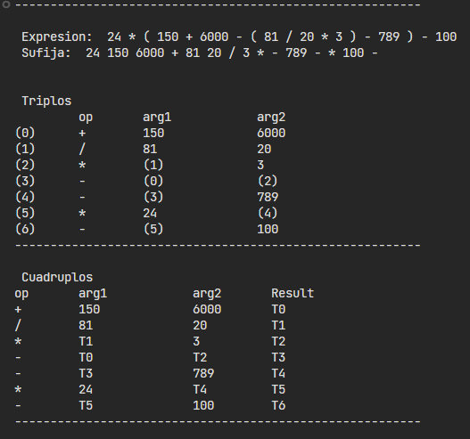

# **Triplos y Cuadruplos**

Expresion matemática infija con conversión a notación postfija(sufija).
Posteriormente evaluación de la expresión sufija mostrando el comportamiento de triplos y cuadruplos.

**Input expresión:** 
- Cada parte de la sentencia debe estar separada por un espacio, ejemplo: X = A + 55 / 2
- Puede contener variables de una sola letra A-Z
- Debe ser una expresión aritmética con o sin asignación a variables de una letra.

**Output**
- Expresion aritmética brindada
- Expresion con notación sufija
- Tabla de triplos
- Tabla de Cuadruplos

  